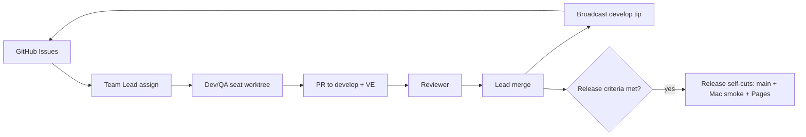

# Fardel team orchestration

Operational runbook for the multi-agent development loop that lands work on `develop`, cuts `main`, and ships [play.sparkify.dev](https://play.sparkify.dev). Recreatable on Antony's Mac Studio via **Grok CLI** (parent agent + subagents).

Related docs: [MAC_STUDIO_GROK_CLI.md](MAC_STUDIO_GROK_CLI.md) · [TEAM_SEATS.md](TEAM_SEATS.md) · [DEPLOY.md](DEPLOY.md) · [DEV_BOX.md](DEV_BOX.md) · [LEARNINGS.md](LEARNINGS.md) · [SCOPE.md](SCOPE.md)

---

## 1. Purpose / north star

**Fardel** is a browser MMORPG (classless / bag-as-build, hordes.io feel) with:

- SpacetimeDB **C#** module as authority
- **Babylon.js + TypeScript / Vite** client (`web/`)
- Headless C# smokes as first proof of Done-when
- Visual evidence hosted on **Cloudflare R2** (`ve.sparkify.dev`) for every user-facing PR

**Unbound Team Lead** (parent) coordinates Devs, QA, Reviewer, Release, and **Art**. The Lead:

- Assigns work **only from GitHub Issues** (not ad-hoc chat wishlists)
- **Never leaves seats idle** while the project has open gaps — if the board is thin, file Issues (or have Art file visual ones) and assign immediately
- Merges to `develop` only after Reviewer feedback is addressed
- Does **not** gate routine Release cuts (Release decides + deploys on its own criteria)
- Does **not** solo-invent features on `main` while the team is live

Autonomy default: keep the loop moving (assign idle seats, nudge reviews, merge when clear). Release owns cut/deploy without Lead greenlight. Surface Antony only for blockers or genuine human gates (non-local DB wipe, elevated approvals).

---

## 2. Roster and roles

| Role | Job | Must NOT |
|------|-----|----------|
| **Team Lead** | Pick Issues; assign seats; broadcast `develop` tip SHAs; merge after Reviewer; run continuous-iterate; unstick Release only on P0 / wipe | Solo invent on `main`; wipe non-local DBs; fan-out spam; micromanage routine cuts |
| **Dev1–Dev5** | Implement one assigned Issue in their seat worktree; open PR → `develop` with VE | Invent without an Issue; PR to `main`; use another seat's ports/DB |
| **QA Bugs** | Smoke matrix, flake repros, regression Issues; optional fix PRs as `qa/<slug>` | Feature invent |
| **QA Feel** | Feel / UX playtests; `feel`-labeled Issues; Mac/Pages FPS truth (not box SwiftShader) | Feature invent |
| **Reviewer** | Review PRs targeting `develop`: correctness, smoke coverage, schema-collision risk, lane conflicts; concrete feedback | Own features; push merges |
| **Release** | **Self-sufficient:** decide cut timing; pin `develop` SHA → `main`; Mac smoke; Pages deploy; VE + release beat | Expand tip silently mid-cut; invent features; run two cuts at once; wipe non-local DBs without Lead |
| **Art** | Visual north star vs [ASSETS.md](ASSETS.md); art-direction briefs; **free OSS/CC0 or original-only** shortlists; break visual work into Issues for Devs; look-language coherence | Invent gameplay; propose **paid** packs; **flip Issue open/close or Fix numbers** after Lead locked an assign; leave Devs idle |

### Seat map (shared computer)

Canonical file: [`tools/scripts/seats.conf`](../tools/scripts/seats.conf). Narrative: [TEAM_SEATS.md](TEAM_SEATS.md). `fardel-seats.env` is a pointer only (3001–3005 retired — too close to prod `:3000`).

| Seat | Spacetime | Vite | DB name | Worktree |
|------|-----------|------|---------|----------|
| `lead` | 3000 | 5173 | `fardel` | `/Users/antbly/dev/fardel` (box: `/workspace/fardel`) |
| `dev-1` … `dev-12` | 3201–3212 | 5201–5212 | `fardel-dev-N` | `$HOME/dev/wt/dev-N` (box: `/workspace/wt/dev-N`) |
| `qa-1` … `qa-8` | 3241–3248 | 5241–5248 | `fardel-qa-N` | `$HOME/dev/wt/qa-N` (box: `/workspace/wt/qa-N`) |

Aliases: `dev1` → `dev-1`, `qa-bugs` → `qa-1`, `qa-feel` → `qa-2`. Claim with `./tools/scripts/seat-claim.sh --role dev`. Never bind `:3000` / db `fardel`.

Per-seat Spacetime data: `$HOME/.local/share/fardel-wt/<slug>`.

Reviewer, Release, and Art do not need a dedicated Spacetime stack by default (Release uses Mac Studio `/Users/antbly/dev/fardel` for smokes + Pages; Art mostly briefs + docs + VE reviews). Art may borrow a Dev seat worktree for presentation spikes when Lead agrees.

---

## 3. Communication topology

Grok Bot / Grok CLI agents talk through channels and 1:1 messages. Hard constraint observed on the Bot product: **channels max out at 6 members**, which forced a split:

| Channel | Members | Purpose |
|---------|---------|---------|
| **Fardel** | Lead + Dev1–5 | Assignments, tip broadcasts, Dev blockers |
| **Fardel QA** | Lead + QA Bugs + QA Feel + Reviewer + Release + Art | Review nudges, feel/smoke reports, release coordination, visual gate notes |
| **Fardel Art** | Lead + Art + QA Feel + Dev3–5 (example seating) | Art briefs, visual wave coordination, look-language reviews |

**Assignment message shape** (1:1 or short channel post):

1. Issue number + title (`#20 Bandage consumable`)
2. Branch name (`dev1/bandage`)
3. Base tip SHA of `develop` at assign time
4. Done-when (smokes + `?ve=…` name)
5. VE expectation (upload PNG to Cloudflare R2 → embed `https://ve.sparkify.dev/...` in PR)
6. Explicit "do not invent past this Issue"

Prefer **GitHub Issues as source of truth** over maintaining parallel markdown backlogs.

Do not re-ping Reviewer or Lead about a PR that is already merged — check `gh pr view` / merge state first.

---

## 4. Git branching model

| Branch | Role |
|--------|------|
| `main` | **Release** / production tip. No feature PRs. |
| `develop` | **Integration** — every day-to-day PR targets this. |
| `seats/<slug>` | Long-lived worktree tips (optional); feature work still ships on short-lived branches. |
| `devN/<slug>`, `client/<slug>`, `qa/<slug>`, `art/<slug>`, `chore/<slug>` | Feature / fix / art / docs branches. |

### PR rules

- Target **`develop`**, never `main` (except Release's promote PR).
- Body includes `Fixes #N` (or `Closes #N`) so merge closes the Issue.
- **VE required** for user-visible changes: embed a real screenshot in the PR body (or sticky comment) hosted on **Cloudflare R2** at `https://ve.sparkify.dev/<pr-or-slug>/<name>.png`.
  Example: `` or ``.
- **Do not** commit routine `ve/*.png` into the git repo (bloat).
- **Do not** use GitHub `user-attachments` / browser paste for new VE (does not scale — each agent needs its own login).
- **Never ask Antony to sign into GitHub** for VE. All seats share Cloudflare credentials (`CLOUDFLARE_API_TOKEN`) and upload via `tools/scripts/ve-upload.sh`.
- How to upload VE:
  1. Capture a real PNG (seat browser / `?ve=…`).
  2. `tools/scripts/ve-upload.sh <local.png> <pr-or-slug>/<name>.png`
  3. Embed the printed `https://ve.sparkify.dev/…` URL in the PR.
- Reviewer bar: image URL must be `https://ve.sparkify.dev/…` (HTTP 200 `image/png`) and render in the PR UI. Reject relative `ve/` links, GitHub `user-attachments` for new work, `raw.githubusercontent.com` VE embeds for new work, and text placeholders.
- Serialize **schema / reducer / Spacetime module** edits to **one Dev at a time**. Client-only cosmetics can parallel.
- After merge: Lead broadcasts new `develop` tip SHA; open branches rebase onto it before next push.

### Attribution

Commits as: `Antony Blyakher <antonyblyakher@gmail.com>` (GitHub: `antonybstack`).

---

## 5. Shared-computer isolation (worktrees + ports)

Agents share **one filesystem** (the Grok Bot box today; Mac Studio in the Grok CLI port). Isolation is not "separate VMs" — it is:

1. **Git worktrees** so concurrent checkouts don't fight
2. **Unique Spacetime ports + data dirs + DB names**
3. **Unique Vite ports**

### Seat bootstrap

```bash
# From repo root of the seat worktree's sibling scripts (lead clone or any wt that has tools/)
source tools/scripts/wt-env.sh <slug>          # exports FARDEL_*
tools/scripts/ensure-seat-spacetime.sh <slug>  # detached start + ping

cd "$FARDEL_WT/server"
spacetime publish "$FARDEL_DB" -y --env local -s "$FARDEL_SPACETIME_URI"
```

Prefer `$FARDEL_SPACETIME_URI` over the Spacetime nickname `local` so seats do not all publish to port 3000.

Local schema drift frequently requires:

```bash
spacetime publish "$FARDEL_DB" -y --env local -s "$FARDEL_SPACETIME_URI" --delete-data=always
```

**Never** pass delete-data against non-local / tunnel / prod DBs without explicit human coordination.

Vite: bind `127.0.0.1:$FARDEL_VITE_PORT` from `$FARDEL_WT/web`.

Smokes (`tools/*Smoke`, mates): after sourcing `wt-env.sh`, they honor `FARDEL_SPACETIME_URI` / `FARDEL_DB` via `GameConstants.ResolveLocalUri()` / `ResolveDatabaseName()`.

Lead defaults match historical single-instance docs in [DEV_BOX.md](DEV_BOX.md) (`http://127.0.0.1:3000` / `fardel`).

---

## 6. GitHub integration (Issues → PR → merge → release)

### Backlog

- Board: https://github.com/antonybstack/fardel/issues
- Labels: `P0` / `P1` / `P2`, `lane:server` | `lane:client` | `lane:qa` | `lane:release` | `lane:art`, `feel`, `flake`, `wave`, `bug`, `enhancement`
- Templates: `.github/ISSUE_TEMPLATE/` (bug, feature, feel)
- Team Lead assigns waves from Issues / milestones, not chat lists

### Merge gate (develop)

A PR is merge-ready when **all** of:

1. Reviewer has reviewed (approve or feedback addressed)
2. Relevant headless smokes green on the seat (or Lead/QA Bugs verification)
3. VE present (`https://ve.sparkify.dev/…` embed in PR) when UI/feel changed
4. `Fixes #N` present
5. No open schema collision with another in-flight server PR

Team Lead merges (not Reviewer, not Dev self-merge by default).

### Release cut

Release decides cuts **without** Lead greenlight.

1. **Cut when** (all true): (a) `develop` tip has Reviewer-cleared merges with meaningful delta since `main`, (b) QA Bugs smokes green on that tip (or Release documents a waive), (c) no open P0 blockers on the tip.
2. Release **pins** a concrete `develop` SHA and opens / merges **develop → main** for that tip only (never silently include later develops mid-cut).
3. **Bindings arity guard** (`./tools/scripts/check-move-bindings-arity.sh`) must pass on the pinned tip before Mac smoke / Pages (#119 / #166).
4. Mac Studio smoke on `/Users/antbly/dev/fardel` (local Spacetime and/or tunnel `dev-db.sparkify.dev`); prefer `./tools/scripts/run-smoke-matrix.sh` (compile fail-fast, #130). **Gate on runner exit code and `results.tsv`** — not merely that the script finished (#148).
5. If green: Vite production build + Cloudflare Pages → `https://play.sparkify.dev`.
6. Post VE + short release beat to Lead / Fardel QA (FYI, not a gate).
7. Later commits on `develop` wait for the next cut.

Deploy topology: [DEPLOY.md](DEPLOY.md).

---

## 7. Developer environment

### Box (Grok Bot computer) — [DEV_BOX.md](DEV_BOX.md)

| Tool | Notes |
|------|-------|
| .NET | `$HOME/.dotnet` — SDK 10 + 8; module TFM `net8.0` |
| Spacetime CLI | `$HOME/.local/bin/spacetime` → **2.10.x** |
| Node | `$HOME/.local/node22/bin` → **22.x** |

```bash
export DOTNET_ROOT=$HOME/.dotnet
export PATH="$HOME/.local/node22/bin:$DOTNET_ROOT:$DOTNET_ROOT/tools:$HOME/.local/bin:$PATH"
```

Do **not** use bare `spacetime start &` in agent shells — the process dies when the shell aborts. Use `ensure-local-spacetime.sh` / `ensure-seat-spacetime.sh` (`setsid -f` on Linux).

### Mac Studio

- Primary clone: `/Users/antbly/dev/fardel`
- Username: `antbly`
- Fish PATH lesson: ensure `fish_add_path ~/.local/bin` is active so `spacetime` resolves
- Tunnel: `cloudflared` → `dev-db.sparkify.dev` → local `:3000` ([DEPLOY.md](DEPLOY.md))
- Feel / FPS claims: verify on Mac or Pages, **not** box SwiftShader

For portable Mac Studio + Grok CLI runbook, see [MAC_STUDIO_GROK_CLI.md](MAC_STUDIO_GROK_CLI.md).

### Client note

Unity WebGL is frozen on `checkpoint/unity-webgl`. Active client is Babylon under `web/`.

---

## 8. Day-to-day loop



### Step-by-step

1. **Lead** scans open Issues (priority, `lane:*`, open PRs, who is idle).
2. **Assign** one non-colliding ticket per idle Dev; serialize `lane:server` schema work.
3. **Seat** fetches latest `develop`, branches, implements, runs seat-local smokes + Vite `?ve=…`.
4. **Open PR** → `develop` with `Fixes #N` + VE screenshot embedded via `https://ve.sparkify.dev/…` (upload with `tools/scripts/ve-upload.sh`).
5. **Reviewer** reviews; author pushes fixes.
6. **Lead** merges, closes Issue, broadcasts tip SHA, asks open branches to rebase.
7. **QA Feel / QA Bugs** pick follow-on Issues (`feel`, `flake`) as assigned — not invent.

### Continuous iterate (Team Lead schedule)

Intent of the live `@every 15m` routine (conceptual; recreate on Mac/Grok CLI as needed):

1. Check open PRs into `develop`; nudge Reviewer if stalled; merge only when gate clears.
2. Unblock idle Devs/QA from Issues (no invent).
3. Prefer cloud coding agents for heavy edits when available; otherwise seat-local work.
4. Tell Antony only on real merges / blockers / release candidates (with screenshot when VE lands).
5. Stay quiet if nothing changed.
6. Never wipe non-local DBs.
7. **No idle seats:** if open Issues < idle Devs, file or ask Art to file the next visual/feel tickets and assign.
8. **No paid art packs** — Art shortlists free/OSS only; otherwise Devs ship original/procedural polish.

---

## 9. Release loop (detail)

**Trigger:** Release itself when cut criteria in §6 are met (Lead ping is optional FYI, not required).

**Release agent checklist:**

1. Diff `main`…`develop`; confirm Reviewer-cleared meaningful delta + green smokes + no P0s.
2. Pin tip SHA; open PR `develop` → `main` (or fast-forward if policy allows) for that SHA only.
3. **Bindings arity preflight (#119 / #166):** from repo root run `./tools/scripts/check-move-bindings-arity.sh` — must pass (server `Move(dx,dz,jump)` matches `web/src/module_bindings/move_reducer.ts` + C# `Move.g.cs`; PlayerPose `VelY`/`LastGroundedMicros` in C# **and** web `player_pose_table.ts` `vel_y`/`last_grounded_micros`). Fail the cut if this fails — do not ship a pin like #112.
4. On Mac: pull that tip at `/Users/antbly/dev/fardel`, publish local if needed, run critical smokes (prefer `./tools/scripts/run-smoke-matrix.sh` — compile fail-fast) + quick Vite playpass. **Require non-zero exit on FAIL** and inspect `results.tsv` — do not green the cut because the runner printed `MATRIX DONE` (#148).
5. Build `web/` → deploy Pages project for `play.sparkify.dev`.
6. Capture VE of live play (or Mac local if Pages lag).
7. Report: main SHA, Pages URL, smoke result, VE path, anything deferred to next cut (FYI to Lead / Fardel QA).

If `develop` moves after the pin, **do not** expand the cut — finish this pin, then evaluate a new cut.

---

## 10. Hard-won orchestration learnings

Game-design learnings stay in [LEARNINGS.md](LEARNINGS.md). Orchestration-specific failure modes:

| Failure | Mitigation |
|---------|------------|
| Solo executor invents on `main` while a Dev has a `develop` PR (race) | Forbid solo invent while team loop is live; Lead stops duplicate streams |
| Agents re-ping already-merged PRs | Always `gh pr view` before nudge; Lead says STOP when looping |
| Auto-review / approval blocks merges or elevated Shell | Escalate honestly to Antony; never credential workarounds |
| Channel 6-member cap | Split **Fardel** vs **Fardel QA**; add **Fardel Art** when visuals need a standing room |
| Idle Devs + empty Issues board | Lead/Art must file Issues and assign — never "wait for inspiration" |
| Visual gap vs hordes/RS/WoW mood | Art owns north star (#31-style); Devs implement presentation Issues; **no paid packs** — free/OSS or DIY |
| Tip moves mid-rebase | `git fetch origin develop` before rebase; Lead broadcasts SHA after every merge |
| GitHub `CONFLICTING` / mergeable noise | Re-fetch base; rebase; reopen PR if GitHub lies |
| Parallel schema PRs | Serialize `lane:server` module edits |
| Release cut expands past pinned tip | Release pins SHA at cut start; refuses silent expansion |
| Box FPS used as feel truth | QA Feel verifies on Mac / Pages |
| Spacetime dies with agent shell abort | `ensure-*-spacetime.sh` + detached/`setsid` |
| Fish can't find `spacetime` on Mac | `fish_add_path ~/.local/bin` |
| Local publish schema drift | `--delete-data=always` **local only** |
| Stale C# `Move.g.cs` after schema change (#118) | After module Move/PlayerPose edits: `spacetime generate --lang csharp` and **commit** `client/.../Generated/` |
| `Move.compat.cs` + 2-arg `Move.g.cs` → CS0111 matrix wipe (#130) | Generate **first**; only then optional 2-arg compat — or delete compat once 3-arg is committed; matrix runner refuses the bad combo / fail-fast on compile |
| Cut ships web bindings behind server Move/PlayerPose (#112/#119/#166) | `./tools/scripts/check-move-bindings-arity.sh` on Release cut checklist (Move + web/C# pose vertical fields) |
| Matrix runner soft-green: TSV has FAIL but shell exit 0 (#148) | Runner aggregates `results.tsv` and exits 1 on FAIL (FLAKE too unless `FARDEL_MATRIX_ALLOW_FLAKE=1`); cut gates on exit code **and** TSV |

---

## 11. Recreating on Mac Studio via Grok CLI

Goal: same loop, **no Grok Bot box**. Parent agent + subagents; Mac Studio filesystem is the shared computer.

**See the comprehensive portable runbook:** [MAC_STUDIO_GROK_CLI.md](MAC_STUDIO_GROK_CLI.md)

That document covers:
- One-time Mac setup (toolchain, worktrees, credentials)
- How parent agent creates and coordinates subagents
- Mapping Bot roles → Mac/Grok CLI equivalents
- Issue assign → PR → Reviewer → merge flow without Bot
- VE upload with shared Cloudflare token
- Release cut to play.sparkify.dev from Mac
- What human gates remain
- Jump/locomotion gating example (harness `?ve=` vs real input)

---

## 12. Token budget / chat hygiene (hard)

Antony is under **severe token spend pressure**. Every message burns budget. All seats follow these rules or stop.

### Banned responses

- **"Ack"** / "Copy" / "On it" / "Standing by" / "Understood" / "Will do"
- Roster restates ("Dev1 on #20, Dev2 idle, …")
- Any reply to Lead corrections — seats fix silently

### Before any PR status ping

Run `gh pr view <n>`. If state = **MERGED** or **CLOSED**: **silence forever** on that PR. Never ping "ready to merge" / "please review" / "VE missing" on dead PRs.

### Max one outbound status per open PR tip SHA

Once you report "PR #N up @ SHA" or "MERGE-READY @ SHA", do **not** send another status on that same SHA unless the PR is blocked or Lead asks. Silence = no change.

### Lead corrections

When Lead says "rebase" / "fix X" / "wrong lane": seat fixes silently. **No** "got it" / "fixing now" reply. Next speak = "PR #N rebased @ new-SHA" when done (if material).

### Spend self-estimate (required)

End every status or PR comment with:

```
spend: light   # short update, no churn
spend: med     # multi-step or moderate detail
spend: heavy   # long explanation or multi-turn needed
```

Agents lack exact token meters; this is the monitor signal for Antony.

### Continuous-iterate cadence

- **~30 minutes** between ticks (not 15m unless crisis)
- Speak only on tip moves, new assigns, merges, or blockers
- Quiet tick = no message at all

### Prefer Cloud Agents over chat

For heavy edits or multi-turn work on the same tip, **launch a Cloud Agent** instead of burning parent context with long back-and-forth. Cloud Agents are cheaper for deep work.

---

**Summary:** Check `gh pr view` first. Silence on MERGED/CLOSED. One status per SHA. No acks. Self-estimate spend. ~30m iterate. Use Cloud Agents for heavy work. **Violating these rules exhausts Antony's budget.**

---

### Merge gate

`Reviewer ✓` + `smokes green` + `VE if UI` + `Fixes #N` + `no schema collision` → **Lead merges to `develop`**

### Labels

`P0` `P1` `P2` · `lane:server` `lane:client` `lane:qa` `lane:release` `lane:art` · `feel` · `flake` · `wave` · `bug` · `enhancement`

### Branch prefixes

`dev1/`…`dev5/` · `client/` · `qa/` · `art/` · `chore/` · Release: `develop`→`main`

### Do not

- Invent without an Issue assign
- Leave Devs idle while the game still has open gaps (file Issues first)
- Open feature PRs to `main`
- Wipe non-local DBs
- Re-ping merged PRs
- Expand a release past the pinned tip
- Treat box SwiftShader FPS as ship feel
- Purchase third-party art packs (forbidden — free/OSS or original only)

---

## 14. Art sourcing (no purchases)

**Hard rule (Antony):** we **cannot purchase** assets. Only **free open-source / CC0** (commercial-use free) packs, or **original/procedural** work we develop — see [ASSETS.md](ASSETS.md).

Flow:

1. **Art** shortlists free/OSS options (license + URL + web-budget fit) **or** specifies DIY procedural upgrades on an Issue.
2. No buy greenlight path — paid itch/store kits are rejected.
3. Import + credits ledger land in the same PR as any third-party free assets.
4. Procedural / kitbash presentation Issues (`lane:art` + `lane:client`) are first-class, not a stopgap apology.

## 15. Minimal assign template (copy/paste)

```text
Assign: #<N> <title>
Branch: <seat>/<slug> off develop @ <sha>
Seat: <slug> (ports/DB per TEAM_SEATS)
Done-when:
  - headless: <Smoke> green
  - VE: ?ve=<name> → `ve-upload.sh` → embed `https://ve.sparkify.dev/…`
  - PR → develop with Fixes #<N>
No invent past this Issue. Rebase if tip moves.
```

---

## 16. Lead autonomy and Issue lifecycle

Team Lead has Antony's mandate to reorganize seats, correct agents, use Cloud Agents, and change GitHub process to hit the product vision.

**Issue lifecycle (hard):**

1. Art/QA may **file** Issues.
2. Lead **assigns** (Issue number + seat + branch). That Fix number is locked.
3. Nobody reopens/closes a sibling duplicate to redirect a Dev mid-flight — Lead only.
4. Devs ship `Fixes #N` for the locked N; stop ack-pinging Lead once confirmed.
5. Prefer one Issue per PR; if a duplicate appears, Lead picks the survivor and comments the lock on both.

**Noise control:** seats report when blocked or when a PR is up — not every "still shipping" beat.

---

## 17. Visual evidence (VE) policy — canonical

### Host

- **Cloudflare R2 bucket:** `fardel-ve`
- **Public domain:** `https://ve.sparkify.dev`

### Upload

```bash
tools/scripts/ve-upload.sh <local.png> <key>
# Example: tools/scripts/ve-upload.sh /tmp/chat.png 98/chat-read.png
```

- Requires `CLOUDFLARE_API_TOKEN` environment variable
- Account ID: `6ea5db25020bce6cbefd6c1cc999bef3` (default in script)
- On Grok Bot box: token may live in box secrets; export into shell for wrangler
- On Mac Studio: set token in parent/env once for all seats
- Optional interim: capture to shared folder; Lead uploads if seat lacks token (fallback only)

### Embed in PR

```markdown

```

or

```html
" alt="description" />
```

### Forbidden for new work

- Committing `ve/*.png` to git repo
- GitHub `user-attachments` paste
- `raw.githubusercontent.com` VE embeds
- Relative `ve/` links in PR
- Disk paths alone as VE

### Never ask Antony to sign into GitHub for VE

All seats share Cloudflare credentials. If upload fails, ping Lead only — do not ask for GitHub login.

### Reviewer bar

- URL must be `https://ve.sparkify.dev/…`
- Must return HTTP 200 `image/png`
- Must render in PR UI

---

## 18. Jump / locomotion gating example

Feel Pages `?ve=jump` harness can PASS (jump physics OK) while manual Space input FAILS (focus-steal #127).

Pattern: harness/`?ve=` automated checks vs real input UX can diverge.

Locomotion-done waits for:
1. Feel harness pass (automated)
2. Post-#127 manual Space recheck (real input)

---

*This document describes the live Bot team loop as of 2026-09-08 and the portable Mac Studio / Grok CLI recreation. When process drifts, update this file in the same PR as the process change.*
